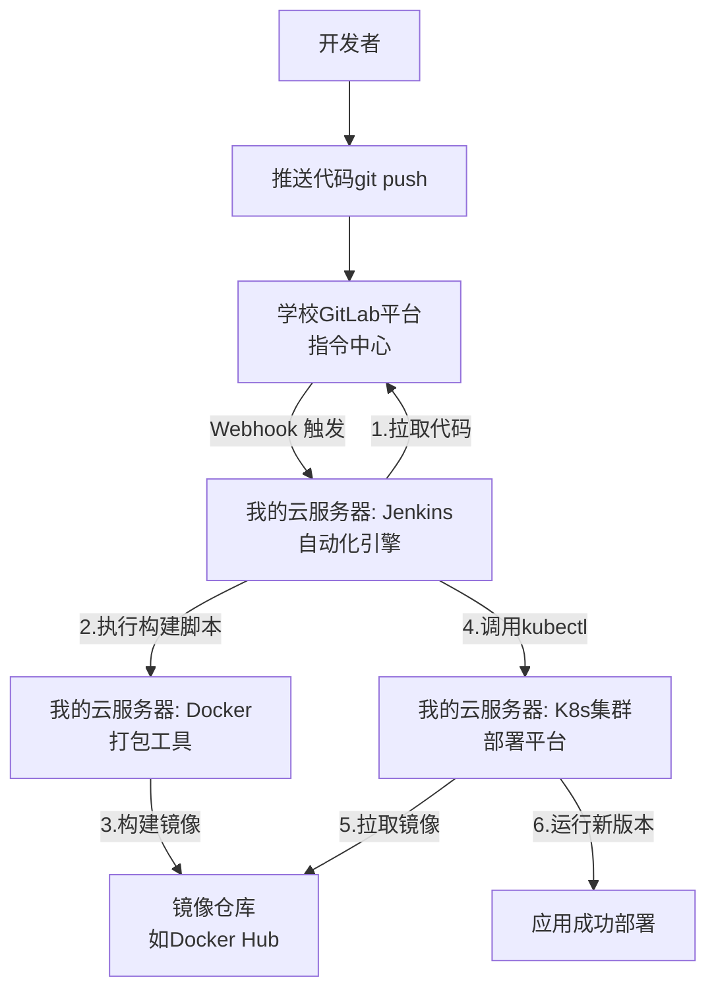

清理一下思路，我们要做的事情其实是借助学校的 GitLab 平台，完成一条自动化流水线

这条流水线的核心是：**当代码被推送到学校的GitLab时，自动触发我云服务器上的Jenkins，由Jenkins 完成 Docker 镜像的构建和推送，并最终部署到 K8s 集群中**


# 1.配环境

## 1.Docker

```bash
sudo apt install docker.io
```

配置镜像源，详见 [[day1-docker#2.测试是否工作]]
## 2. Kuberetes（使用 k3s）

```bash
curl -sfL http://rancher-mirror.cnrancher.com/k3s/k3s-install.sh | INSTALL_K3S_MIRROR=cn sh - #使用镜像
```

